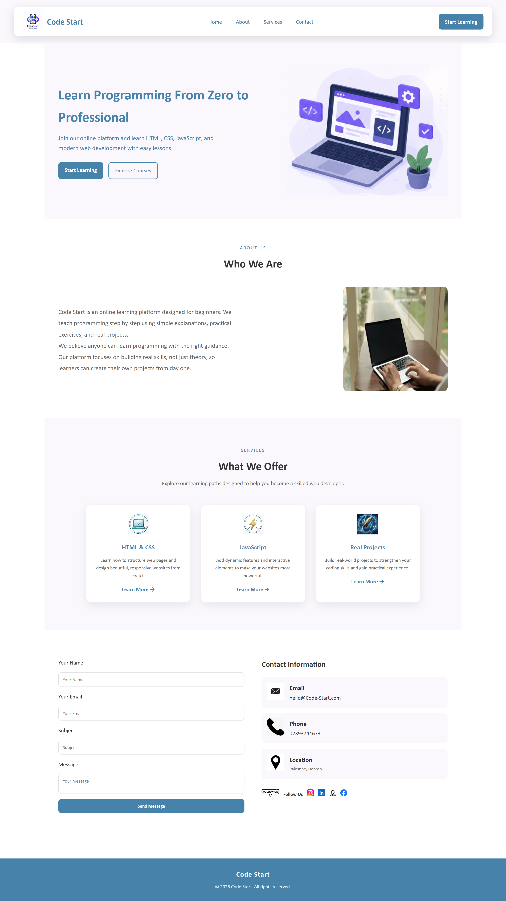

# 🌐 Code Start - Learning Platform

A responsive landing page built using HTML5 and CSS3.  
The project demonstrates a structured layout with multiple sections including navigation, hero, about, services, and contact form.

---

## 📷 Project Preview



---

## ✨ Features

- Responsive layout for different screen sizes
- Navigation bar with section links
- Hero section with call-to-action buttons
- About section describing the platform
- Services section displaying learning topics
- Contact form layout
- Social media links section
- Semantic HTML structure using sections

---

## 🛠️ Technologies Used

- HTML5
- CSS3
- Flexbox
- CSS Variables
- Media Queries

---

## 📁 Project Structure
```text
Languages-page/
└── Landing-page/
    ├── images/
    │   ├── screenshot.png
    │   ├── code.png
    │   ├── com.jpg
    │   ├── computer.webp
    │   ├── css.jpg
    │   ├── javascript.jpg
    │   ├── projects.jpg
    │   ├── email.webp
    │   ├── telephone.png
    │   ├── location.avif
    │   ├── follow.png
    │   ├── inst.jpg
    │   ├── link.jpg
    │   ├── git.png
    │   ├── facebook.png
    │
    ├── index.html
    ├── style.css
    └── README.md
```

---

## 🎯 Project Purpose

This project was created to practice building a structured and responsive landing page using HTML and CSS.

---

## 👩‍💻 Author

**Baraah Alameh**